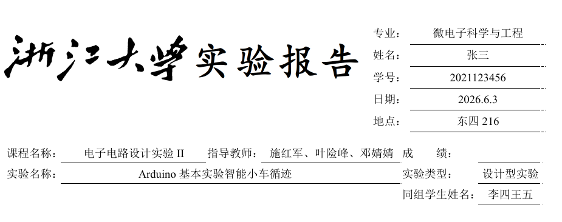

# ZJU LaTeX 实验报告模板

这是一个浙江大学实验报告 LaTeX 模板，从原 Typst 实验报告样式修改而来。

## 文件结构

```text
├── main.tex          # 正文
├── zjureport.sty     # 模板样式
├── reference.bib     # 参考文献
└── figures/          # 图片
```

## 使用方法

在 `main.tex` 顶部修改 `\zjusetup{...}` 中的课程名称 *course*、姓名 *author*、学号 *school-id*、专业 *major* 等字段，然后编写正文即可。

常用命令：

- `\cover`：生成封面。
- `\tableofcontents`：生成目录。
- `\ISEEHeader`：生成实验报告表头，并从正文开始显示装订线。

注：这里的表头采用列表方式, 为了解决有时实验名称过长的问题, 使用了一个判断逻辑自动换行，效果如下



不过在我这届电设还是交纸质稿，如果交纸质稿的话建议手写, 把 `\zjusetup{···}` 中相应字段删去即可, 调整排版不是一件愉悦的事。

- `\importantbox{...}`、`\notebox{...}`、`\warningbox{...}`：提示框,我一般不使用, 可在 `zjureport.sty` 中自行修改样式。
- `lstlisting`：代码块, 采用了我常用的格式, 亦可在 `zjureport.sty` 中自行修改样式。


## 编译

推荐使用 XeLaTeX


## 更新

### 2026-04-30

解决代码块影响装订线显示的问题

### 2026-06-10

`\section{}` 的编号改为中文大写数字并左对齐, 更符合实验报告样式。

增加了注释, 方便阅读修改; 略微修改了一部分冗余代码。


## 参考

[typst版本](https://github.com/xw-Soleil/ReportTemplate_Soleil) 

[typst版本cc98](https://www.cc98.org/topic/6346287)

---
[latex报告模板](https://cn.overleaf.com/latex/templates/zhe-jiang-da-xue-ke-cheng-lun-wen-mo-ban/mjpzqvgsmdzn)

## 声明

仅供参考
